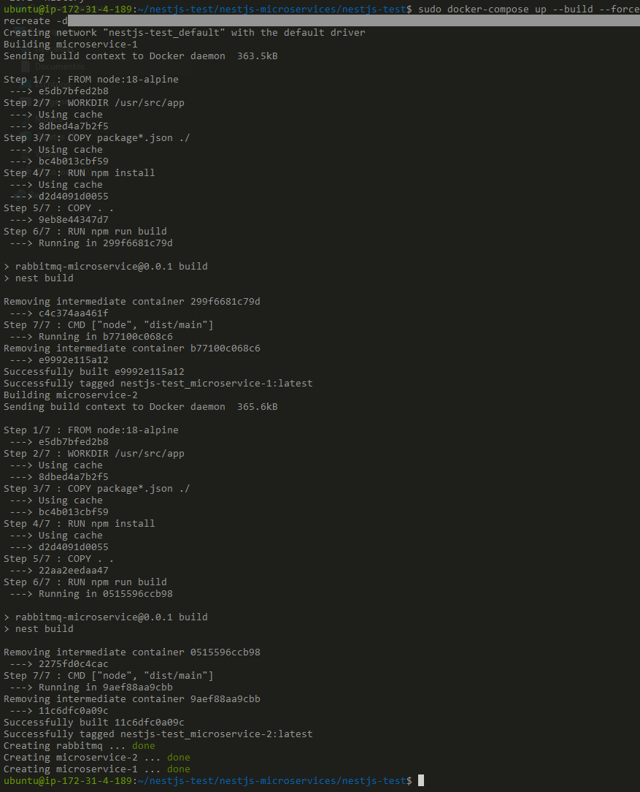
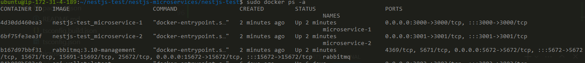

# Microservices with NestJS and RabbitMQ

Proyecto de examen para un número entero dado , general el siguiente resultado:


## Getting Started

### Cloning the Repository

Clonar respositorio:

```bash
git clone https://github.com/cesarIhunter/nestjs-test.git
cd nestjs-test
```
## Running the Services

### To build and run the Docker containers, use the following command:

```bash
sudo docker-compose up --build
```

Estructura del proyecto

## Project Structure

```plaintext
.
├── docker-compose.yml
├── microservice-1
│   ├── Dockerfile
│   ├── nest-cli.json
│   ├── package.json
│   ├── src
│   │   ├── app.controller.ts
│   │   ├── app.module.ts
│   │   ├── app.service.ts
│   │   ├── main.ts
│   │   ├── models
│   │   │   └── dto
│   │   │       └── message.dto.ts
│   │   └── rabbitmq
│   │       ├── rabbitmq.module.ts
│   │       └── rabbitmq.service.ts
│   ├── tsconfig.build.json
│   └── tsconfig.json
├── microservice-2
│   ├── Dockerfile
│   ├── nest-cli.json
│   ├── package.json
│   ├── src
│   │   ├── app.controller.ts
│   │   ├── app.module.ts
│   │   ├── app.service.ts
│   │   ├── main.ts
│   │   ├── models
│   │   │   └── dto
│   │   │       └── message.dto.ts
│   │   └── rabbitmq
│   │       ├── rabbitmq.module.ts
│   │       └── rabbitmq.service.ts
│   ├── tsconfig.build.json
│   └── tsconfig.json
└── README.md
```

## Usage 

### Envio del entero

 `microservice-1` manda el mensaje al broker y lo resive `microservice-2`, use the following CURL command:

```bash
curl -X POST 44.222.185.134:3000 -H "Content-Type: application/json" -d '{"numberInteger":15}'
```

## Aplicación montada en Docker y AWS

el aplicativo esta alojado sobre un servidor EC2 AWS , al cuál se puede mandar un CURL como el siguiente:


Para levantar el Docker container, ejecutar el siguiente comando:

```bash
sudo docker-compose up --build --force-recreate -d
```

Resutlado:





